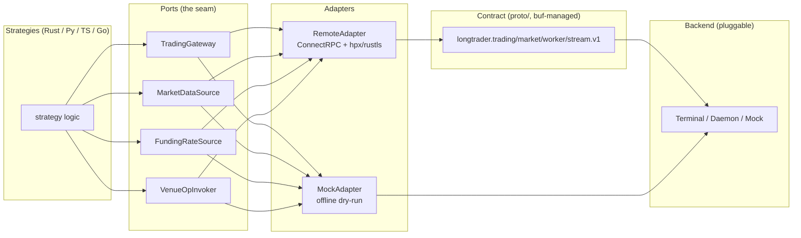

<div align="center">

# LongTrader

**A local strategy host for portable trading strategies over a contract-first ConnectRPC API.**

[](https://www.rust-lang.org/)
[](LICENSE)
[](proto/)
[](#development)
[](https://crates.io/crates/longtrader-cli)
[](https://pypi.org/project/longtrader-sdk/)
[](https://www.npmjs.com/package/@longcipher/longtrader-sdk)

*Write a strategy once. Run it in Rust, Python, TypeScript, or Go against the same generated, versioned contract. Your backend is a detail.*

[English](README.md) · [中文](README.zh.md) · [Architecture](docs/architecture.md) · [Getting Started](docs/getting-started.md) · [Bare Protocol Guide](docs/bare-protocol-guide.md)

</div>

---

## Why LongTrader

Most trading frameworks lock you into one language, one exchange SDK, and one deploy target. LongTrader takes the opposite stance:

- **The contract is the product.** Every service, message, and wire format under `proto/` is the single source of truth, managed with [`buf`](https://buf.build). The Rust domain, the Python/TypeScript/Go SDKs, and the Terminal backend are all *thin consumers* of generated stubs. Breaking changes are caught by `buf breaking` in CI before they ever ship.
- **Strategies are portable.** A grid or trend strategy depends only on two traits — `TradingGateway` and `MarketDataSource`. There is no hidden domain coupling, no exchange-specific import, no framework magic. The same strategy ships in four languages.
- **The backend is pluggable.** Run against a mock venue, a private terminal, or your own daemon. Swap transports in the `adapters/` layer without touching a single strategy line.
- **The control plane is deterministic.** Session lifecycle (`ATTACHED → SYNCING → ACTIVE → KILL_SWITCH_TRIPPED`) is a real state machine with a 3× heartbeat lease, an atomic reconcile snapshot, and a per-session kill-switch policy. Losing the lease cancels your orders — by design.

> **Status:** open-source preview. Built from the ground up as an original LongTrader implementation. The contract is stable at `longtrader.*.v1`; SDKs are thin wrappers over generated stubs and are never hand-edited.

---

## What you get

| | |
|---|---|
| **Contract-first API** | `proto/longtrader/**` defines trading, market, worker/session, data, backtest, ops and stream services. `buf breaking` guards every PR. |
| **20+ native strategies** | Grid / market-making, trend-following, portfolio rebalancing, risk & operations, and analytics — each isolated behind `ports.rs`. |
| **Deterministic session control plane** | Lease-based liveness, atomic `ReconcileState`, per-session `KillSwitchPolicy` (`session` / `all` / `none`). |
| **Thin, consistent SDKs** | Python, TypeScript, and Go mirrors of the same canonical layout. Generated code is never hand-edited. |
| **Hardened worker** | `tracing`-only observability, `eyre`/`thiserror` error split, `hpx` + `rustls` transport, `tokio` async, and strict `clippy::pedantic`/`nursery` lints under `-D warnings`. |
| **Local-first, secret-safe** | Tokens load from a file only (constant-time `subtle` compare, never logged). No secrets are committed. |

---

## Architecture

LongTrader is a hexagonal host. Strategies talk to *ports*; adapters own the transport; the contract owns the wire.



Text form (canonical layers):

```
proto/                        # buf v2, single source of truth (longtrader.*.v1)
crates/longtrader-contract/   # generated types + ConnectRPC traits (build.rs → buffa/connectrpc)
bin/longtrader-worker/        # strategy host: ports, session, adapters, envelope, strategies
bin/longtrader-cli/           # CLI client for the Terminal API (binary: longtrader)
sdks/{python,typescript,go}/  # thin wrappers over generated stubs (contract/session/ports/...)
```

### Canonical layout per language

| Canonical dir | Rust | Python | TypeScript | Go |
|---|---|---|---|---|
| `contract/` | `crates/longtrader-contract` | `sdks/python/longtrader_sdk/proto/` | `sdks/typescript/src/gen/` | `sdks/go/gen/` |
| `session/` | `bin/longtrader-worker/src/session/` | `longtrader_sdk/session.py` | `src/session.ts` | `session/` |
| `ports/` | `src/ports.rs` | `longtrader_sdk/ports.py` | `src/ports.ts` | `ports/` |
| `adapters/` | `src/adapters/{remote,mock}.rs` | Connect-over-httpx in `session.py` | Connect-over-undici in `session.ts` | Connect-over-http in `session/` |
| `strategies/` | `src/strategies/` | `examples/grid_strategy.py` | `examples/grid_strategy.ts` | `strategies/` |
| `examples/` | `examples/` / `docs/` | `sdks/python/examples/` | `sdks/typescript/examples/` | `sdks/go/examples/` |

---

## Packages

| Language | Package | Registry |
|---|---|---|
| Rust (contract) | [`longtrader-contract`](https://crates.io/crates/longtrader-contract) | [](https://crates.io/crates/longtrader-contract) |
| Rust (protocol) | [`longtrader-proto`](https://crates.io/crates/longtrader-proto) | [](https://crates.io/crates/longtrader-proto) |
| Rust (CLI) | [`longtrader-cli`](https://crates.io/crates/longtrader-cli) | [](https://crates.io/crates/longtrader-cli) |
| Rust (worker) | [`longtrader-worker`](https://crates.io/crates/longtrader-worker) | [](https://crates.io/crates/longtrader-worker) |
| Python | [`longtrader-sdk`](https://pypi.org/project/longtrader-sdk/) | [](https://pypi.org/project/longtrader-sdk/) |
| TypeScript | [`@longcipher/longtrader-sdk`](https://www.npmjs.com/package/@longcipher/longtrader-sdk) | [](https://www.npmjs.com/package/@longcipher/longtrader-sdk) |
| Go | [`sdks/go`](https://pkg.go.dev/github.com/longcipher/longtrader/sdks/go) | [](https://pkg.go.dev/github.com/longcipher/longtrader/sdks/go) |

> The Go SDK is a generated-stub scaffold; the `Session` API is available in Rust, Python, and TypeScript today. See [sdks/go/README.md](sdks/go/README.md).

---

## Quick start

### Prerequisites

Rust stable + nightly (`rustfmt`/`clippy`), [`just`](https://github.com/casey/just), and [`buf`](https://buf.build) (for contract lint/generation).

```bash
just setup          # installs cargo-mutants, cargo-shear, cargo-sort, typos, rumdl
just check          # cargo check --all-targets --all-features
just lint           # typos + rumdl + cargo sort/fmt + clippy -D warnings + shear
just test           # cargo test --all-features (unit + proptest)
just build          # cargo build --workspace
```

### Run the worker (a live strategy)

```bash
# Regenerate SDK stubs (offline-safe)
just sdk-generate

# Run a grid strategy against the mock venue
cargo run -p longtrader-worker -- --config config.toml
```

Minimal `config.toml`:

```toml
backend = "terminal"                          # mock | terminal | api (unified)
api_endpoint = "http://127.0.0.1:8810"      # embedded longtrader-terminal; standalone longtrader-api serve uses :8080
api_token_file = "/run/secrets/longtrader_token"
listen_endpoint = "127.0.0.1:9000"          # WorkerSessionService + proxies (optional)

[strategy]
type = "simple_grid"
[strategy.params]
symbol = "BTCUSDT"
exchange_id = "mock"
lower_price = "90000"
upper_price = "110000"
num_levels = 10
qty_per_level = "0.001"
```

The token is loaded from `api_token_file` only (trimmed, never logged) and sent as `Authorization: Bearer <token>` over `hpx` with `rustls`.

### Drive it from the CLI

```bash
cargo run -p longtrader-cli -- --help
longtrader health                    # health check
longtrader symbols --venue mock      # list tradeable symbols
longtrader candles BTCUSDT --timeframe M1 --limit 100
longtrader buy BTCUSDT 0.001 --price 95000
longtrader stream --topics MARKET_LITE,TRADING   # live updates (Ctrl+C to stop)
```

### Or from an SDK (same lifecycle in every language)

```python
from longtrader_sdk import Session
s = Session.attach("http://127.0.0.1:8080", token="YOUR_TERMINAL_TOKEN")
s.start_heartbeat()
snap = s.reconcile_state()
print(s.session_id, s.state, snap.snapshot_sequence)
s.close()
```

```ts
import { Session } from "@longcipher/longtrader-sdk";
const s = await Session.attach("http://127.0.0.1:8080", "YOUR_TERMINAL_TOKEN");
s.startHeartbeat();
const snap = await s.reconcileState();
console.log(s.sessionId, s.state, snap.snapshotSequence);
s.stop();
```

Attach → heartbeat → reconcile → gate to `ACTIVE`. This is the contract every language implements identically.

---

## CLI (`longtrader-cli`)

A command-line client for the LongTrader Terminal API. Binary name: `longtrader`.

```bash
# Global flags
--endpoint <url>      # Terminal API endpoint (default: http://127.0.0.1:8810)
--token <token>       # Bearer token (also read from $LONGTRADER_TOKEN)
--venue <name>        # Venue name (default: mock)
--format <format>     # Output format: table, json (default: table)

# Commands
longtrader health                                    # Health check
longtrader venues                                    # List connected venues
longtrader symbols --venue mock                      # List tradeable symbols
longtrader candles <SYMBOL> --timeframe M1 --limit 100 # OHLCV candles
longtrader book <SYMBOL> --depth 10                  # Order book snapshot
longtrader search <QUERY> --limit 50                 # Search symbols
longtrader account                                   # Account balances
longtrader positions                                 # Open positions
longtrader orders --symbol <SYMBOL>                  # Open orders
longtrader history --limit 100                       # Order history
longtrader buy <SYMBOL> <QTY> --price <PRICE>        # Place buy order (limit; omit --price for market)
longtrader sell <SYMBOL> <QTY> --price <PRICE>       # Place sell order
longtrader cancel <ORDER_ID>                         # Cancel order
longtrader close <POSITION_ID>                       # Close position
longtrader stream --topics MARKET_LITE,TRADING       # Stream live updates
```

> `buy`/`sell` place a **limit** order when `--price` is given and a **market** order when it is omitted. Order-by-id and strategy-control RPCs are available in the contract; the CLI surface covers the market/trading read-write lifecycle end to end.

Timeframes: `M1`, `M5`, `M15`, `M30`, `H1`, `H4`, `D1`, `W1`.
Topics: `MARKET_LITE`, `MARKET_HEAVY`, `TRADING`, `RUNTIME`, `FUNDING`, `DERIVATIVES`.

Output is script-friendly: `--format json` emits pipeable JSON on **stdout**, with errors and hints on **stderr** and a non-zero exit code on failure.

---

## Strategies

Each strategy under `bin/longtrader-worker/src/strategies/<name>/` ships its own `README.md` (and `README.zh.md`) with parameters, risk notes, and an example config. Select one via `strategy.type`:

| Category | Strategies |
|---|---|
| Grid / Market Making | `simple_grid`, `boll_grid`, `hedge_grid`, `fixed_maker`, `cross_maker`, `cross_depth_maker`, `cross_fixed_maker` |
| Trend Following | `ema_cross`, `supertrend` |
| Portfolio & Rebalancing | `rebalance`, `market_cap`, `dca_scheduler` |
| Risk & Operations | `sentinel`, `autoborrow`, `balance_align`, `convert`, `deposit_transfer` |
| Signals & Analytics | `irr`, `nav_recorder`, `premium_monitor`, `random_entry`, `xfunding_lite` |

All strategies are original LongTrader implementations and depend only on `ports::{TradingGateway, MarketDataSource}` (and, where noted, the extended `FundingRateSource` / `VenueOpInvoker` / `WalletGateway` caps). Transport selection lives in `adapters/`. See [docs/strategy-author-guide.md](docs/strategy-author-guide.md) to write your own.

---

## Development

```bash
just format     # rumdl fmt + cargo sort + cargo +nightly fmt
just fix        # rumdl --fix + clippy --fix
just mutation   # cargo mutants (focused on library crates)
just ci         # lint + test + build (mirrors CI)
```

Contract toolchain:

```bash
just proto-lint     # buf lint on proto/
just proto-breaking # breaking check vs main
just sdk-generate   # local stub generation (offline-safe via scripts/gen-proto.sh)
```

Workspace rules: root `[workspace.dependencies]` carries numeric versions only (no default features); sub-crates use `workspace = true`. Prefer `hpx` over `reqwest`, `tokio` for async, `tracing` for observability. See [CONTRIBUTING.md](CONTRIBUTING.md).

---

## Documentation

- [Architecture](docs/architecture.md) — layers, control-plane state machine, envelope framing.
- [Getting Started](docs/getting-started.md) — install, configure, run your first strategy.
- [Bare Protocol Guide](docs/bare-protocol-guide.md) — ConnectRPC wire format, auth, and streaming for non-SDK clients.
- [Strategy Author Guide](docs/strategy-author-guide.md) — build and register a portable strategy.
- [Contract Style Guide](docs/contract-style-guide.md) — enum/timestamp/pagination/money/error conventions.
- [FAQ](docs/faq.md) — venues, tokens, upgrade path.

---

## Security

- No secrets are committed. Tokens are file-loaded (`api_token_file`) and compared with constant-time `subtle`.
- `proto/longtrader/exchange/v1/exchange_daemon.proto` was removed in this open-source release (legacy private daemon API). Use `longtrader.market/trading/stream/ops.v1` instead.
- Report vulnerabilities via GitHub Security Advisories; do not open public issues for sensitive reports. See [SECURITY.md](SECURITY.md).

---

## License

Apache-2.0 — see [LICENSE](LICENSE). SDK packages (`sdks/python`, `sdks/typescript`) are also Apache-2.0 unless noted otherwise.

## Acknowledgements

Built with `buffa`/`connectrpc`, `hpx`, `tokio`, `rust_decimal`, and `buf`.
