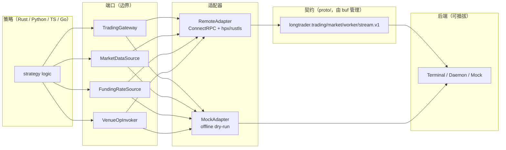

# LongTrader

> [English](README.md) | **中文**

**基于契约优先的 ConnectRPC API 构建的本地策略宿主，可运行可移植的交易策略。**

[](https://www.rust-lang.org/)
[](LICENSE)
[](proto/)
[](#开发)
[](https://crates.io/crates/longtrader-cli)
[](https://pypi.org/project/longtrader-sdk/)
[](https://www.npmjs.com/package/@longcipher/longtrader-sdk)

*一次编写策略，即可在 Rust、Python、TypeScript 或 Go 中，基于同一份生成式、带版本的契约运行。后端由你自行决定。*

[English](README.md) · [中文](README.zh.md) · [Architecture](docs/architecture.md) · [Getting Started](docs/getting-started.md) · [Bare Protocol Guide](docs/bare-protocol-guide.md)

---

## 为什么选择 LongTrader

大多数交易框架会把你锁定在单一语言、单一交易所 SDK 和单一部署目标上。LongTrader 反其道而行：

- **契约即产品。** `proto/` 下的每个服务、消息与线格式都是唯一事实来源，由 [`buf`](https://buf.build) 管理。Rust 领域层、Python/TypeScript/Go SDK 以及 Terminal 后端，都是生成桩代码的*轻量消费者*。破坏性变更会在合入前由 CI 中的 `buf breaking` 捕获。
- **策略可移植。** 一个网格或趋势策略仅依赖两个 trait —— `TradingGateway` 与 `MarketDataSource`。没有隐藏的领域耦合，没有交易所特定的导入，也没有框架魔法。同一策略可在四种语言中运行。
- **后端可插拔。** 可对接模拟撮合场所（mock venue）、私有终端或你自己的 daemon。在 `adapters/` 层切换传输实现，无需改动任何策略代码。
- **控制面确定可控。** 会话生命周期（`ATTACHED → SYNCING → ACTIVE → KILL_SWITCH_TRIPPED`）是一个真正的状态机，具备 3 倍心跳租约、原子化的 reconcile 快照，以及按会话的熔断（kill-switch）策略。租约丢失即取消你的订单 —— 这是设计使然。

> **状态：** 开源预览版。本项目为从零起步的原创 LongTrader 实现。契约在 `longtrader.*.v1` 已稳定；SDK 均为生成桩代码的轻量封装，且绝不会手工修改。

---

## 你将获得

| | |
|---|---|
| **契约优先 API** | `proto/longtrader/**` 定义了交易、行情、worker/会话、数据、回测、运维与流服务。`buf breaking` 守护每一个 PR。 |
| **20+ 原生策略** | 网格 / 做市、趋势跟踪、组合再平衡、风控与运维，以及分析类策略 —— 各自隔离于 `ports.rs` 之后。 |
| **确定性的会话控制面** | 基于租约的存活检测、原子化的 `ReconcileState`、按会话的 `KillSwitchPolicy`（`session` / `all` / `none`）。 |
| **轻量且一致的 SDK** | Python、TypeScript 与 Go 的镜像，遵循同一套规范布局。生成代码永不手工修改。 |
| **加固的策略宿主（worker）** | 仅使用 `tracing` 的可观测性、`eyre`/`thiserror` 的错误分层、`hpx` + `rustls` 传输、`tokio` 异步，以及在 `-D warnings` 下严格的 `clippy::pedantic`/`nursery` 检查。 |
| **本地优先、密钥安全** | Token 仅从文件加载（常量时间 `subtle` 比较，永不落日志）。不提交任何密钥。 |

---

## 架构

LongTrader 是一个六边形（hexagonal）宿主。策略与*端口（ports）*对话；适配器掌控传输；契约掌控线格式。



文本形式（规范层）：

```
proto/                        # buf v2, single source of truth (longtrader.*.v1)
crates/longtrader-contract/   # generated types + ConnectRPC traits (build.rs → buffa/connectrpc)
bin/longtrader-worker/        # strategy host: ports, session, adapters, envelope, strategies
bin/longtrader-cli/           # CLI client for the Terminal API (binary: longtrader)
sdks/{python,typescript,go}/  # thin wrappers over generated stubs (contract/session/ports/...)
```

### 各语言规范布局

| 规范目录 | Rust | Python | TypeScript | Go |
|---|---|---|---|---|
| `contract/` | `crates/longtrader-contract` | `sdks/python/longtrader_sdk/proto/` | `sdks/typescript/src/gen/` | `sdks/go/gen/` |
| `session/` | `bin/longtrader-worker/src/session/` | `longtrader_sdk/session.py` | `src/session.ts` | `session/` |
| `ports/` | `src/ports.rs` | `longtrader_sdk/ports.py` | `src/ports.ts` | `ports/` |
| `adapters/` | `src/adapters/{remote,mock}.rs` | `session.py` 中的 Connect-over-httpx | `session.ts` 中的 Connect-over-undici | `session/` 中的 Connect-over-http |
| `strategies/` | `src/strategies/` | `examples/grid_strategy.py` | `examples/grid_strategy.ts` | `strategies/` |
| `examples/` | `examples/` / `docs/` | `sdks/python/examples/` | `sdks/typescript/examples/` | `sdks/go/examples/` |

---

## 发布包

| 语言 | 包 | 仓库 |
|---|---|---|
| Rust（契约） | [`longtrader-contract`](https://crates.io/crates/longtrader-contract) | [](https://crates.io/crates/longtrader-contract) |
| Rust（协议） | [`longtrader-proto`](https://crates.io/crates/longtrader-proto) | [](https://crates.io/crates/longtrader-proto) |
| Rust（CLI） | [`longtrader-cli`](https://crates.io/crates/longtrader-cli) | [](https://crates.io/crates/longtrader-cli) |
| Rust（worker） | [`longtrader-worker`](https://crates.io/crates/longtrader-worker) | [](https://crates.io/crates/longtrader-worker) |
| Python | [`longtrader-sdk`](https://pypi.org/project/longtrader-sdk/) | [](https://pypi.org/project/longtrader-sdk/) |
| TypeScript | [`@longcipher/longtrader-sdk`](https://www.npmjs.com/package/@longcipher/longtrader-sdk) | [](https://www.npmjs.com/package/@longcipher/longtrader-sdk) |
| Go | [`sdks/go`](https://pkg.go.dev/github.com/longcipher/longtrader/sdks/go) | [](https://pkg.go.dev/github.com/longcipher/longtrader/sdks/go) |

> Go SDK 目前为生成桩代码的脚手架；`Session` API 现仅提供于 Rust、Python 与 TypeScript。详见 [sdks/go/README.md](sdks/go/README.md)。

---

## 快速开始

### 前置要求

Rust stable + nightly（`rustfmt`/`clippy`）、[`just`](https://github.com/casey/just)，以及 [`buf`](https://buf.build)（用于契约检查与生成）。

```bash
just setup          # installs cargo-mutants, cargo-shear, cargo-sort, typos, rumdl
just check          # cargo check --all-targets --all-features
just lint           # typos + rumdl + cargo sort/fmt + clippy -D warnings + shear
just test           # cargo test --all-features (unit + proptest)
just build          # cargo build --workspace
```

### 运行策略宿主（worker）

```bash
# Regenerate SDK stubs (offline-safe)
just sdk-generate

# Run a grid strategy against the mock venue
cargo run -p longtrader-worker -- --config config.toml
```

最小 `config.toml`：

```toml
backend = "terminal"                          # mock | terminal | api (unified)
api_endpoint = "http://127.0.0.1:8810"      # embedded longtrader-terminal; standalone longtrader-api serve uses :8080
api_token_file = "/run/secrets/longtrader_token"
listen_endpoint = "127.0.0.1:9000"          # WorkerSessionService + proxies (optional)

[strategy]
type = "simple_grid"
[strategy.params]
symbol = "BTCUSDT"
exchange_id = "mock"
lower_price = "90000"
upper_price = "110000"
num_levels = 10
qty_per_level = "0.001"
```

Token 仅从 `api_token_file` 加载（已去除首尾空白，永不落日志），并经 `hpx` + `rustls` 以 `Authorization: Bearer <token>` 形式发送。

### 通过 CLI 驱动

```bash
cargo run -p longtrader-cli -- --help
longtrader health                    # 健康检查
longtrader symbols --venue mock      # 列出可交易品种
longtrader candles BTCUSDT --timeframe M1 --limit 100
longtrader buy BTCUSDT 0.001 --price 95000      # 限价（给定价格）
longtrader sell BTCUSDT 0.001                   # 市价（无 --price）
longtrader stream --topics MARKET_LITE,TRADING   # 实时更新（Ctrl+C 退出）
```

### 或通过 SDK（每种语言生命周期一致）

```python
from longtrader_sdk import Session
s = Session.attach("http://127.0.0.1:8080", token="YOUR_TERMINAL_TOKEN")
s.start_heartbeat()
snap = s.reconcile_state()
print(s.session_id, s.state, snap.snapshot_sequence)
s.close()
```

```ts
import { Session } from "@longcipher/longtrader-sdk";
const s = await Session.attach("http://127.0.0.1:8080", "YOUR_TERMINAL_TOKEN");
s.startHeartbeat();
const snap = await s.reconcileState();
console.log(s.sessionId, s.state, snap.snapshotSequence);
s.stop();
```

Attach → 心跳 → reconcile → 门控至 `ACTIVE`。这是每种语言都以相同方式实现的契约。

---

## CLI（`longtrader-cli`）

LongTrader Terminal API 的命令行客户端。二进制名称：`longtrader`。

```bash
# Global flags
--endpoint <url>      # Terminal API endpoint (default: http://127.0.0.1:8810)
--token <token>       # Bearer token (also read from $LONGTRADER_TOKEN)
--venue <name>        # Venue name (default: mock)
--format <format>     # Output format: table, json (default: table)

# Commands
longtrader health                                    # 健康检查
longtrader venues                                    # 列出已连接交易所
longtrader symbols --venue mock                      # 列出可交易品种
longtrader candles <SYMBOL> --timeframe M1 --limit 100 # OHLCV K 线
longtrader book <SYMBOL> --depth 10                  # 订单簿快照
longtrader search <QUERY> --limit 50                 # 搜索品种
longtrader account                                   # 账户余额
longtrader positions                                 # 当前持仓
longtrader orders --symbol <SYMBOL>                  # 当前挂单
longtrader history --limit 100                       # 历史订单
longtrader buy <SYMBOL> <QTY> --price <PRICE>        # 下限买单（给定价格）；省略则市价
longtrader sell <SYMBOL> <QTY> --price <PRICE>       # 下限卖单
longtrader cancel <ORDER_ID>                         # 取消订单
longtrader close <POSITION_ID>                       # 平仓
longtrader stream --topics MARKET_LITE,TRADING       # 订阅实时更新
```

> `buy`/`sell` 在给定 `--price` 时下达**限价**单，在其省略时下达**市价**单。按 id 查单与策略控制的 RPC 已在契约中提供；CLI 覆盖的接口涵盖了市场/交易读写生命周期的端到端流程。

Timeframes: `M1`, `M5`, `M15`, `M30`, `H1`, `H4`, `D1`, `W1`.
Topics: `MARKET_LITE`, `MARKET_HEAVY`, `TRADING`, `RUNTIME`, `FUNDING`, `DERIVATIVES`.

输出对脚本友好：`--format json` 会在 **stdout** 输出可管道化的 JSON，错误与提示输出到 **stderr**，失败时返回非零退出码。

---

## 策略

位于 `bin/longtrader-worker/src/strategies/<name>/` 下的每个策略都自带 `README.md`（及 `README.zh.md`），内含参数、风险说明与示例配置。通过 `strategy.type` 选择策略：

| 分类 | 策略 |
|---|---|
| 网格 / 做市 | `simple_grid`, `boll_grid`, `hedge_grid`, `fixed_maker`, `cross_maker`, `cross_depth_maker`, `cross_fixed_maker` |
| 趋势跟踪 | `ema_cross`, `supertrend` |
| 组合与再平衡 | `rebalance`, `market_cap`, `dca_scheduler` |
| 风控与运维 | `sentinel`, `autoborrow`, `balance_align`, `convert`, `deposit_transfer` |
| 信号与分析 | `irr`, `nav_recorder`, `premium_monitor`, `random_entry`, `xfunding_lite` |

所有策略均为原创的 LongTrader 实现，且仅依赖 `ports::{TradingGateway, MarketDataSource}`（及在注明之处，扩展的 `FundingRateSource` / `VenueOpInvoker` / `WalletGateway` 能力）。传输选择位于 `adapters/`。如需自行编写，请参阅 [docs/strategy-author-guide.md](docs/strategy-author-guide.md)。

---

## 开发

```bash
just format     # rumdl fmt + cargo sort + cargo +nightly fmt
just fix        # rumdl --fix + clippy --fix
just mutation   # cargo mutants (focused on library crates)
just ci         # lint + test + build (mirrors CI)
```

契约工具链：

```bash
just proto-lint     # buf lint on proto/
just proto-breaking # breaking check vs main
just sdk-generate   # local stub generation (offline-safe via scripts/gen-proto.sh)
```

工作区规则：根级 `[workspace.dependencies]` 仅承载数字版本（无默认特性）；子 crate 使用 `workspace = true`。传输优先使用 `hpx` 而非 `reqwest`，异步使用 `tokio`，可观测性使用 `tracing`。详见 [CONTRIBUTING.md](CONTRIBUTING.md)。

---

## 文档

- [Architecture](docs/architecture.md) —— 分层、控制面状态机与信封（envelope）封装。
- [Getting Started](docs/getting-started.md) —— 安装、配置并运行你的第一个策略。
- [Bare Protocol Guide](docs/bare-protocol-guide.md) —— 面向非 SDK 客户端的 ConnectRPC 线格式、认证与流式传输。
- [Strategy Author Guide](docs/strategy-author-guide.md) —— 构建并注册一个可移植策略。
- [FAQ](docs/faq.md) —— 场所（venue）、令牌（token）与升级路径。

---

## 安全

- 不提交任何密钥。Token 通过文件加载（`api_token_file`），并使用常量时间 `subtle` 比较。
- `proto/longtrader/exchange/v1/exchange_daemon.proto` 已在本开源版本中移除（遗留的私有 daemon API）。请改用 `longtrader.market/trading/stream/ops.v1`。
- 请通过 GitHub Security Advisories 报告漏洞；涉及敏感内容的报告请勿公开提 issue。详见 [SECURITY.md](SECURITY.md)。

---

## 许可证

Apache-2.0 —— 见 [LICENSE](LICENSE)。SDK 包（`sdks/python`、`sdks/typescript`）除非另有说明，同样采用 Apache-2.0。

## 致谢

基于 `buffa`/`connectrpc`、`hpx`、`tokio`、`rust_decimal` 与 `buf` 构建。
