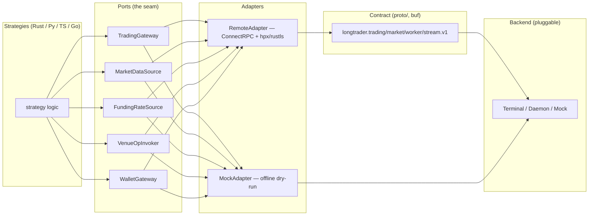
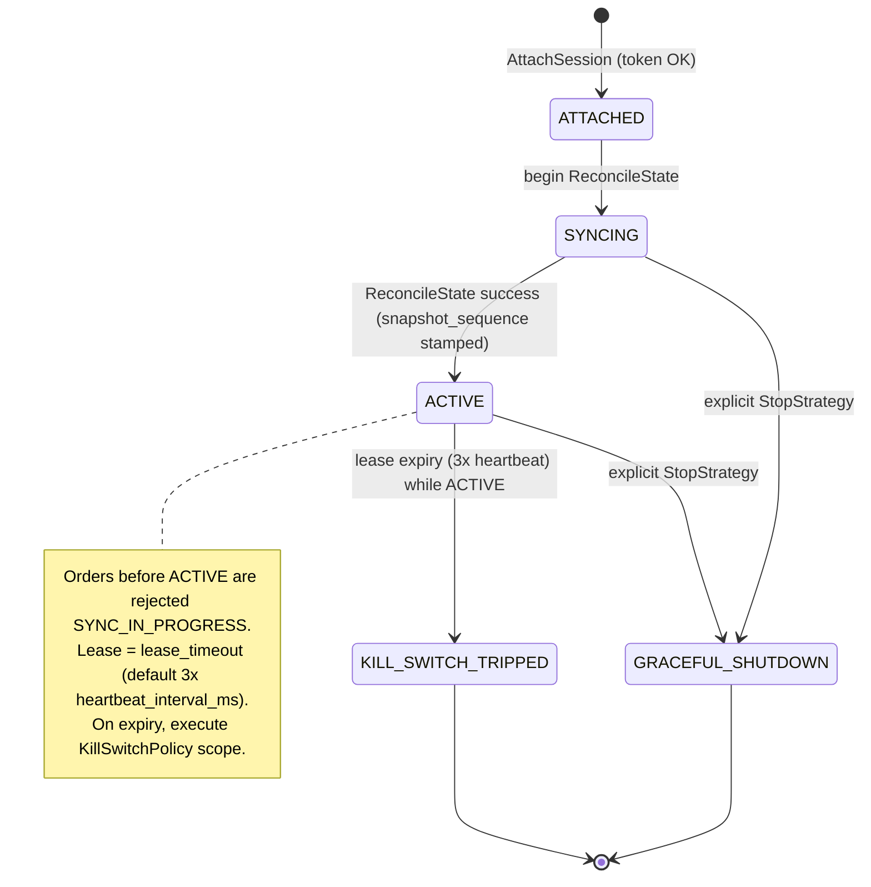

# Architecture

LongTrader is a **hexagonal** host. Strategies depend only on *ports*; adapters
own the transport; the contract owns the wire.

## Layers

```
proto/                        # buf v2, single source of truth (longtrader.*.v1)
crates/longtrader-contract/   # generated types + ConnectRPC traits (build.rs -> buffa/connectrpc)
bin/longtrader-worker/        # strategy host: ports, session, adapters, envelope, strategies
bin/longtrader-cli/           # CLI client for the Terminal API (binary: longtrader)
sdks/{python,typescript,go}/  # thin wrappers over generated stubs
```

| Layer | Role |
|---|---|
| **Contract** (`proto/`, `crates/longtrader-contract`) | Authoritative `.proto` messages & services; `buf breaking` guards every PR. |
| **Crates** | `longtrader-contract` (generated types), `longtrader-proto`, `longtrader-cli`, `longtrader-worker`. |
| **Worker** (`bin/longtrader-worker`) | Strategy host: ports, session control plane, adapters, envelope. |
| **CLI** (`bin/longtrader-cli`, binary `longtrader`) | Terminal API client (health/venues/symbols/candles/book/…/buy/sell/cancel/close/stream). |
| **SDKs** (`sdks/python`, `sdks/typescript`, `sdks/go`) | Thin, generated-stub wrappers; Python & TypeScript are complete, Go is a scaffold. |

## Hexagonal seam: ports & adapters



Strategies program against `ports::{TradingGateway, MarketDataSource}` (and the
extended `FundingRateSource` / `VenueOpInvoker` / `WalletGateway` caps where
needed). `RemoteAdapter` talks ConnectRPC over `hpx` + `rustls`; `MockAdapter`
runs offline. Neither is visible to strategy code.

## Session control-plane state machine

The lifecycle is **server-enforced** and deterministic:



- `LEASE_HEARTBEAT_BUDGET = 3` (`bin/longtrader-worker/src/session/mod.rs`):
  `lease_timeout` defaults to **3 × negotiated `heartbeat_interval_ms`**
  (`DEFAULT_HEARTBEAT_MS = 10_000`).
- `KeepAlive` feeds the watchdog each interval. Exhausting the missed-heartbeat
  budget while `ACTIVE` trips the configured `KillSwitchPolicy`.
- **ReconcileState** returns a snapshot (`ReconcileStateResponse`) stamped with
  `snapshot_sequence` / `snapshot_time` (balances, positions, open_orders at one
  watermark); buffered deltas after `snapshot_sequence` are replayed to converge.
- **KillSwitchPolicy** scope routing (`KillSwitchPolicy.Scope`):
  - `SESSION_ORDERS` — cancel only this session's tracked `client_order_id`s.
  - `ALL_ORDERS` — cancel every open order of the bound account(s).
  - `NONE` — log only, no cancellations.

## Connect envelope framing

Server-streaming RPCs use `Content-Type: application/connect+proto` and a
**5-byte envelope** (see `bin/longtrader-worker/src/envelope.rs` and the
[Bare Protocol Guide](bare-protocol-guide.md) §5):

```
[flags:1][u32 big-endian length:4][payload:N]
flags 0x00 = message (proto), 0x02 = end-of-stream (JSON)
```

## Canonical per-language layout

| Canonical dir | Rust | Python | TypeScript | Go |
|---|---|---|---|---|
| `contract/` | `crates/longtrader-contract` | `sdks/python/longtrader_sdk/proto/` | `sdks/typescript/src/gen/` | `sdks/go/gen/` |
| `session/` | `bin/longtrader-worker/src/session/` | `longtrader_sdk/session.py` | `src/session.ts` | `session/` |
| `ports/` | `src/ports.rs` | `longtrader_sdk/ports.py` | `src/ports.ts` | `ports/` |
| `adapters/` | `src/adapters/{remote,mock}.rs` | Connect-over-httpx in `session.py` | Connect-over-undici in `session.ts` | Connect-over-http in `session/` |
| `strategies/` | `src/strategies/` | `examples/grid_strategy.py` | `examples/grid_strategy.ts` | `strategies/` |
| `examples/` | `examples/` / `docs/` | `sdks/python/examples/` | `sdks/typescript/examples/` | `sdks/go/examples/` |

> Note: Python/TypeScript bury real code under `longtrader_sdk/` and `src/`
> respectively, with thin placeholder redirect dirs at the SDK root. See
> [sdks/README.md](../sdks/README.md) for the "layout reality check".
